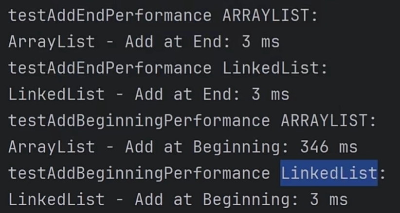
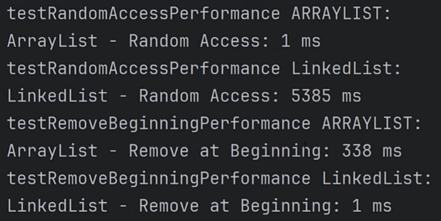

学习Udemy Java MasterClass的笔记
# Hierarchy of Collection Interfaces and Classes

```
Collection
├── ListClass
│   ├── ArrayList
│   ├── LinkedList
│   ├── Vector
│   └── Stack
├── Set
│   ├── HashSet
│   ├── LinkedHashSet
│   └── TreeSet
└── Queue
    ├── PriorityQueue
    └── Deque
        ├── ArrayDeque
        └── LinkedList (implements both ListClass and Deque)

```


# ListClass Interface

List是一个有序的集合，允许重复，并提供位置访问。

它是Java Collections的核心接口，由Arraylist、LinkedList、Vector和Stack等类实现。

List是动态的，不像固定大小的数组，允许它根据需要增长或缩小。

它维持插入顺序，确保元素按其位置被访问。

## ArrayList

ArrayList提供快速的**基于索引的访问**，但由于元素移动，中间插入和删除的速度较慢。它是高效和动态调整大小。

典型用例：用于频繁索引访问的动态数组，如缓存、查找、end增长。

重要方法：
- `add(E e)`
- `remove(Object o)`
- `get(int index)`
- `size()`

## LinkedList

LinkedList对于**开始或中间**或结束时的**快速插入和删除**是理想的，但由于非索引结构，对于随机访问来说速度较慢。

典型用例：最适合具有频繁结束操作的动态列表，如queue和deque

重要方法：
- `addFirst(E e)`
- `addLast(E e)`
- `removeFirst()`
- `removeLast()`



## Vector

与ArrayList类似，但是是线程安全的，Vector由于同步而降低了性能成本。与较新的并发集合相比，它现在不太受欢迎。

典型用例：最适合多线程环境中线程安全的动态列表，不过较新的集合通常更好。

重要方法：
- `add(E e)`
- `remove(Object o)`
- `elementAt(int index)`

## Stack

Stack是一个线程安全的LlFO结构体，来自Vector。用于递归和解析。

典型用例：将Stack用于LlFO需求，例如递归、表达式求值或撤销机制，但考虑Deque以提高性能。

重要方法：
- `push(E item)`
- `pop()`
- `peek()`
- `isEmpty()`
- `search(Object o)`

# Set Interface

Java中的Set接口存储唯一的项，就像一袋不同的弹珠。它是防止重复的理想方法，但与列表不同的是，Set不维护元素顺序。

 ## HashSet

HashSet使用散列表实现Set接口，确保快速操作但不维护顺序。

HashSet就像一个无序的盒子，快速存储和检索项目，确保没有重复。

现实生活中的例子：像宾客名单，防止重复的名字，专注于独特性，而不关心顺序。

重要方法：
- `add(String e)`
- `contains(Object o)`
- `remove(Object o)`
- `clone()`
- `clear()`
- `isEmpty()`
- `size()`

## LinkedHashSet

不常用

Ordered collection that maintains insertion order

##TreeSet

不常用

Sorted collection with no duplicates